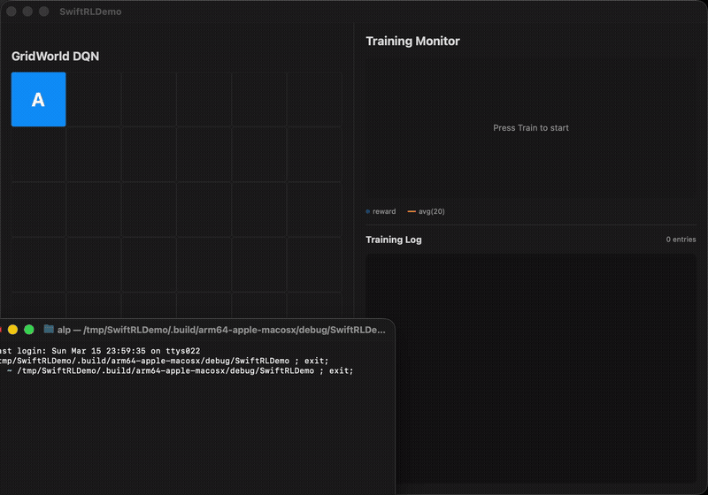

# SwiftGrad

A tiny, fully functional **autograd engine** and **neural network library** in pure Swift. Inspired by Andrej Karpathy's [micrograd](https://github.com/karpathy/micrograd).

SwiftGrad implements reverse-mode automatic differentiation (backpropagation) over a dynamically built computation graph. It's the same algorithm that powers PyTorch and TensorFlow  - just on scalars instead of tensors, in ~250 lines of Swift.



*SwiftUI macOS app: DQN agent training on GridWorld with live reward chart and training log.*

<details>
<summary>CLI demo (terminal)</summary>


</details>

## Why?

- **Educational:** Small enough to read in one sitting, complete enough to train real networks
- **Pure Swift:** Zero dependencies, no Python, no bridging  - runs natively on Apple Silicon
- **Foundation:** The autograd engine that powers [SwiftRL](https://github.com/SwiftAutograd/SwiftRL), an on-device reinforcement learning library

## Installation

Add SwiftGrad to your `Package.swift`:

```swift
dependencies: [
    .package(url: "https://github.com/SwiftAutograd/SwiftGrad.git", from: "0.1.0")
]
```

## Quick Start

```swift
import SwiftGrad

// Create values and build a computation graph
let a = Value(-4.0)
let b = Value(2.0)
let c = a + b
let d = a * b + b.power(3)
let e = c - d
let f = e.power(2)

// Compute gradients automatically
f.backward()

print(a.grad) // ∂f/∂a
print(b.grad) // ∂f/∂b
```

### Train a Neural Network

```swift
import SwiftGrad

// 2-layer MLP: 3 inputs → 4 hidden → 1 output
let model = MLP(inputSize: 3, layerSizes: [4, 4, 1])
let optimizer = SGD(parameters: model.parameters(), learningRate: 0.05)

let xs: [[Value]] = [
    [Value(2.0), Value(3.0), Value(-1.0)],
    [Value(3.0), Value(-1.0), Value(0.5)],
    [Value(0.5), Value(1.0), Value(1.0)],
    [Value(1.0), Value(1.0), Value(-1.0)],
]
let targets = [1.0, -1.0, -1.0, 1.0]

for epoch in 0..<100 {
    let predictions = xs.map { model.forward($0) }
    let loss = Loss.mse(predicted: predictions, targets: targets)

    model.zeroGrad()
    loss.backward()
    optimizer.step()

    if epoch % 10 == 0 {
        print("Epoch \(epoch): loss = \(loss.data)")
    }
}
```

## Architecture

SwiftGrad maps 1:1 to micrograd's architecture:

| Component | File | Lines | Description |
|---|---|---|---|
| **Engine** | `Engine.swift` | ~150 | `Value` class with autograd  - tracks computation graph, runs `backward()` via topological sort |
| **Neural Net** | `NN.swift` | ~80 | `Neuron`, `Layer`, `MLP`  - built on `Value`, uses `callAsFunction` for Pythonic syntax |
| **Training** | `Losses.swift` | ~40 | `Loss.mse`, `Loss.hingeLoss`, `SGD` optimizer |

### How It Works

Every `Value` remembers how it was created. When you write `a + b`, the result stores references to `a` and `b` as children, along with the operation (`+`) and a closure that knows how to compute the local gradient.

Calling `.backward()` on any value:
1. Builds a topological ordering of the entire computation graph
2. Sets the output gradient to 1.0
3. Walks the graph in reverse, applying the chain rule at each node

This is the exact same algorithm (reverse-mode autodiff) used by PyTorch, JAX, and every modern ML framework.

### Swift-Specific Design Choices

- **`Value` is a `class`** (reference type)  - nodes in the computation graph are shared and aliased, just like Python
- **Operator overloads** (`+`, `*`, `-`, `/`) replace Python's `__add__`, `__mul__`, etc.
- **`callAsFunction`** enables `neuron(x)` and `model(x)` syntax, matching Python's `__call__`
- **`weak` captures** in `_backward` closures prevent retain cycles in the computation graph
- **`Module` protocol** with `parameters()` and `zeroGrad()` provides a clean training interface

### Operations Supported

| Operation | Forward | Backward (gradient) |
|---|---|---|
| `a + b` | `a.data + b.data` | `∂out/∂a = 1`, `∂out/∂b = 1` |
| `a * b` | `a.data * b.data` | `∂out/∂a = b`, `∂out/∂b = a` |
| `a.power(n)` | `a.data^n` | `∂out/∂a = n * a^(n-1)` |
| `a.relu()` | `max(0, a.data)` | `∂out/∂a = (a > 0) ? 1 : 0` |
| `a.tanh()` | `tanh(a.data)` | `∂out/∂a = 1 - tanh²(a)` |
| `a.exp()` | `e^a.data` | `∂out/∂a = e^a` |
| `-a`, `a - b`, `a / b` | Composed from above | Chain rule through composition |

## Tests

```bash
swift test
```

9 tests covering:
- Value addition, multiplication, ReLU
- Full backpropagation chain (verified against PyTorch)
- Neuron/MLP forward and backward passes
- Zero gradient reset
- Training loop convergence

## Part of the SwiftAutograd Organization

| Repository | Description | Status |
|---|---|---|
| **[SwiftGrad](https://github.com/SwiftAutograd/SwiftGrad)** | Autograd engine (you are here) | Working |
| [SwiftRL](https://github.com/SwiftAutograd/SwiftRL) | On-device reinforcement learning | In development |
| [SwiftRLDemos](https://github.com/SwiftAutograd/SwiftRLDemos) | Demo apps (Snake, 2048, Connect Four) | Planned |

## Acknowledgments

- [micrograd](https://github.com/karpathy/micrograd) by Andrej Karpathy  - the direct inspiration for this project
- [Karpathy's micrograd lecture](https://www.youtube.com/watch?v=VMj-3S1tku0)  - "The spelled-out intro to neural networks and backpropagation"

## License

MIT  - see [LICENSE](LICENSE).
